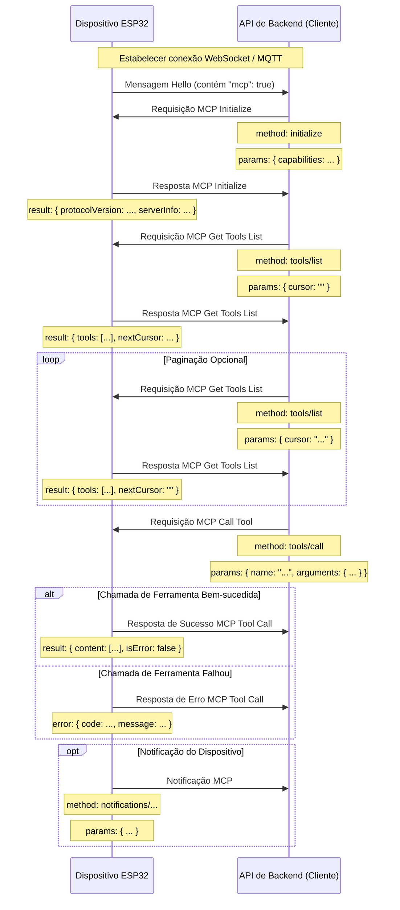

# Fluxo de Interação MCP (Model Context Protocol)

AVISO: Gerado com auxílio de IA, ao implementar serviços de backend, consulte o código para confirmar os detalhes!!

O protocolo MCP neste projeto é usado para comunicação entre a API de backend (cliente MCP) e o dispositivo ESP32 (servidor MCP), permitindo que o backend descubra e invoque funcionalidades (ferramentas) fornecidas pelo dispositivo.
 
## Formato do Protocolo

De acordo com o código (`main/protocols/protocol.cc`, `main/mcp_server.cc`), as mensagens MCP são encapsuladas no corpo da mensagem do protocolo de comunicação básico (como WebSocket ou MQTT). Sua estrutura interna segue a especificação [JSON-RPC 2.0](https://www.jsonrpc.org/specification).

Exemplo da estrutura geral da mensagem:

```json
{
  "session_id": "...", // 会话 ID
  "type": "mcp",       // 消息类型，固定为 "mcp"
  "payload": {         // JSON-RPC 2.0 负载
    "jsonrpc": "2.0",
    "method": "...",   // 方法名 (如 "initialize", "tools/list", "tools/call")
    "params": { ... }, // 方法参数 (对于 request)
    "id": ...,         // 请求 ID (对于 request 和 response)
    "result": { ... }, // 方法执行结果 (对于 success response)
    "error": { ... }   // 错误信息 (对于 error response)
  }
}
```

Onde a parte `payload` é uma mensagem JSON-RPC 2.0 padrão:

- `jsonrpc`: String fixa "2.0".
- `method`: Nome do método a ser chamado (para Request).
- `params`: Parâmetros do método, um valor estruturado, geralmente um objeto (para Request).
- `id`: Identificador da requisição, fornecido pelo cliente ao enviar a requisição, retornado como está pelo servidor na resposta. Usado para combinar requisições e respostas.
- `result`: Resultado quando o método é executado com sucesso (para Success Response).
- `error`: Informação de erro quando a execução do método falha (para Error Response).

## Fluxo de Interação e Momento de Envio

A interação do MCP gira principalmente em torno do cliente (API de backend) descobrindo e invocando "ferramentas" (Tools) no dispositivo.

1.  **Estabelecimento de Conexão e Anúncio de Capacidades**

    - **Momento:** Após o dispositivo iniciar e conectar com sucesso à API de backend.
    - **Remetente:** Dispositivo.
    - **Mensagem:** O dispositivo envia uma mensagem "hello" do protocolo básico para a API de backend, contendo a lista de capacidades suportadas pelo dispositivo, por exemplo, suporte ao protocolo MCP (`"mcp": true`).
    - **Exemplo (não é carga útil MCP, mas mensagem do protocolo básico):**
      ```json
      {
        "type": "hello",
        "version": ...,
        "features": {
          "mcp": true,
          ...
        },
        "transport": "websocket", // ou "mqtt"
        "audio_params": { ... },
        "session_id": "..." // Pode ser definido após o dispositivo receber hello do servidor
      }
      ```

2.  **Inicialização da Sessão MCP**

    - **Momento:** Após a API de backend receber a mensagem "hello" do dispositivo e confirmar que o dispositivo suporta MCP, geralmente enviada como a primeira requisição da sessão MCP.
    - **Remetente:** API de backend (cliente).
    - **Método:** `initialize`
    - **Mensagem (carga útil MCP):**

      ```json
      {
        "jsonrpc": "2.0",
        "method": "initialize",
        "params": {
          "capabilities": {
            // Capacidades do cliente, opcional

            // Relacionado à visão da câmera
            "vision": {
              "url": "...", // Câmera: endereço de processamento de imagem (deve ser http, não websocket)
              "token": "..." // token da url
            }

            // ... outras capacidades do cliente
          }
        },
        "id": 1 // ID da requisição
      }
      ```

    - **Momento de resposta do dispositivo:** Após o dispositivo receber e processar a requisição `initialize`.
    - **Mensagem de resposta do dispositivo (carga útil MCP):**
      ```json
      {
        "jsonrpc": "2.0",
        "id": 1, // Corresponde ao ID da requisição
        "result": {
          "protocolVersion": "2024-11-05",
          "capabilities": {
            "tools": {} // Os tools aqui parecem não listar informações detalhadas, necessário tools/list
          },
          "serverInfo": {
            "name": "...", // Nome do dispositivo (BOARD_NAME)
            "version": "..." // Versão do firmware do dispositivo
          }
        }
      }
      ```

3.  **Descobrir Lista de Ferramentas do Dispositivo**

    - **Momento:** Quando a API de backend precisa obter a lista específica de funcionalidades (ferramentas) suportadas pelo dispositivo e suas formas de invocação.
    - **Remetente:** API de backend (cliente).
    - **Método:** `tools/list`
    - **Mensagem (carga útil MCP):**
      ```json
      {
        "jsonrpc": "2.0",
        "method": "tools/list",
        "params": {
          "cursor": "" // Usado para paginação, primeira requisição com string vazia
        },
        "id": 2 // ID da requisição
      }
      ```
    - **Momento de resposta do dispositivo:** Após o dispositivo receber a requisição `tools/list` e gerar a lista de ferramentas.
    - **Mensagem de resposta do dispositivo (carga útil MCP):**
      ```json
      {
        "jsonrpc": "2.0",
        "id": 2, // Corresponde ao ID da requisição
        "result": {
          "tools": [ // Lista de objetos de ferramentas
            {
              "name": "self.get_device_status",
              "description": "...",
              "inputSchema": { ... } // Schema de parâmetros
            },
            {
              "name": "self.audio_speaker.set_volume",
              "description": "...",
              "inputSchema": { ... } // Schema de parâmetros
            }
            // ... mais ferramentas
          ],
          "nextCursor": "..." // Se a lista for grande e precisar paginação, conterá o valor cursor para a próxima requisição
        }
      }
      ```
    - **Tratamento de paginação:** Se o campo `nextCursor` não estiver vazio, o cliente precisa enviar novamente a requisição `tools/list`, incluindo este valor `cursor` nos `params` para obter a próxima página de ferramentas.

4.  **Invocar Ferramenta do Dispositivo**

    - **Momento:** Quando a API de backend precisa executar uma funcionalidade específica no dispositivo.
    - **Remetente:** API de backend (cliente).
    - **Método:** `tools/call`
    - **Mensagem (carga útil MCP):**
      ```json
      {
        "jsonrpc": "2.0",
        "method": "tools/call",
        "params": {
          "name": "self.audio_speaker.set_volume", // Nome da ferramenta a ser invocada
          "arguments": {
            // Parâmetros da ferramenta, formato de objeto
            "volume": 50 // Nome do parâmetro e seu valor
          }
        },
        "id": 3 // ID da requisição
      }
      ```
    - **Momento de resposta do dispositivo:** Após o dispositivo receber a requisição `tools/call` e executar a função da ferramenta correspondente.
    - **Mensagem de resposta de sucesso do dispositivo (carga útil MCP):**
      ```json
      {
        "jsonrpc": "2.0",
        "id": 3, // Corresponde ao ID da requisição
        "result": {
          "content": [
            // Conteúdo do resultado da execução da ferramenta
            { "type": "text", "text": "true" } // Exemplo: set_volume retorna bool
          ],
          "isError": false // Indica sucesso
        }
      }
      ```
    - **Mensagem de resposta de erro do dispositivo (carga útil MCP):**
      ```json
      {
        "jsonrpc": "2.0",
        "id": 3, // Corresponde ao ID da requisição
        "error": {
          "code": -32601, // Código de erro JSON-RPC, por exemplo Method not found (-32601)
          "message": "Unknown tool: self.non_existent_tool" // Descrição do erro
        }
      }
      ```

5.  **Dispositivo Envia Mensagens Proativamente (Notifications)**
    - **Momento:** Quando ocorre um evento interno no dispositivo que precisa notificar a API de backend (por exemplo, mudança de estado. Embora os exemplos de código não mostrem ferramentas explícitas enviando tais mensagens, a existência de `Application::SendMcpMessage` sugere que o dispositivo pode enviar mensagens MCP proativamente).
    - **Remetente:** Dispositivo (servidor).
    - **Método:** Possivelmente um nome de método começando com `notifications/`, ou outro método customizado.
    - **Mensagem (carga útil MCP):** Segue o formato JSON-RPC Notification, sem campo `id`.
      ```json
      {
        "jsonrpc": "2.0",
        "method": "notifications/state_changed", // Exemplo de nome de método
        "params": {
          "newState": "idle",
          "oldState": "connecting"
        }
        // Sem campo id
      }
      ```
    - **Processamento pela API de backend:** Após receber a Notification, a API de backend faz o processamento correspondente, mas não responde.

## Diagrama de Interação

Abaixo está um diagrama de sequência simplificado, mostrando o fluxo principal de mensagens MCP:



Este documento apresenta o fluxo principal de interação do protocolo MCP neste projeto. Os detalhes específicos dos parâmetros e funcionalidades das ferramentas devem ser consultados em `main/mcp_server.cc` em `McpServer::AddCommonTools` e nas implementações de cada ferramenta.
