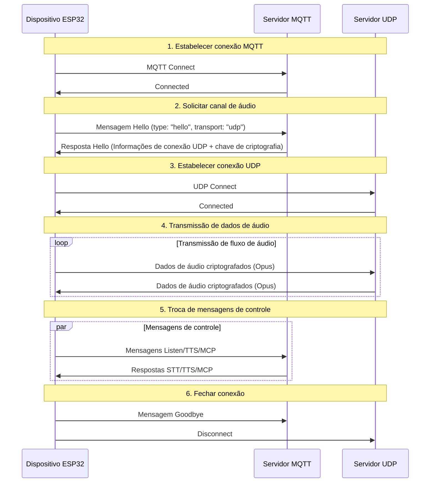
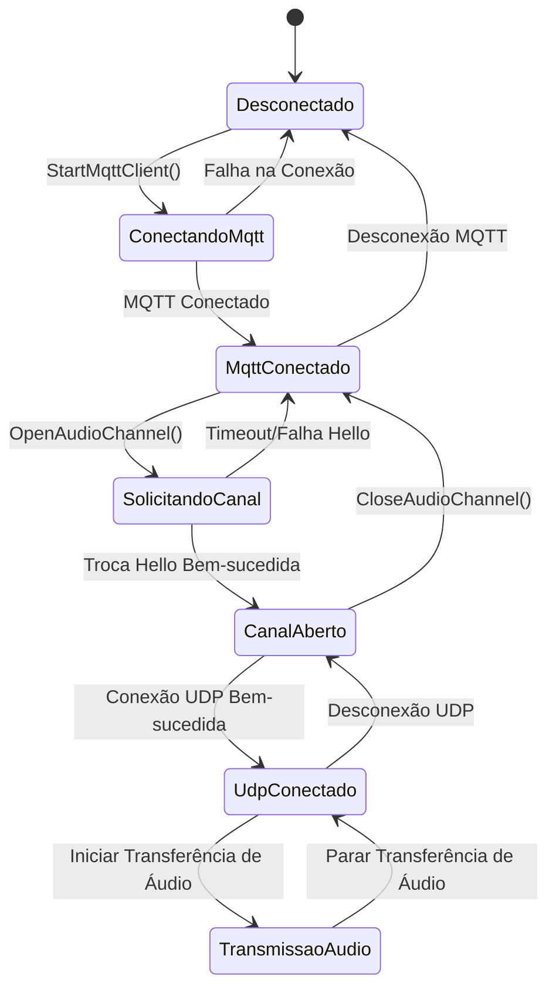

# Documentação do Protocolo de Comunicação Híbrido MQTT + UDP

Documentação do protocolo de comunicação híbrido MQTT + UDP organizada com base na implementação do código, descrevendo como o dispositivo e o servidor realizam transmissão de mensagens de controle através do MQTT e transmissão de dados de áudio através do UDP.

---

## 1. Visão Geral do Protocolo

Este protocolo adota transmissão híbrida:
- **MQTT**: Usado para mensagens de controle, sincronização de estado, troca de dados JSON
- **UDP**: Usado para transmissão de dados de áudio em tempo real, com suporte a criptografia

### 1.1 Características do Protocolo

- **Design de Dois Canais**: Separação de controle e dados, garantindo tempo real
- **Transmissão Criptografada**: Dados de áudio UDP usando criptografia AES-CTR
- **Proteção de Número de Sequência**: Previne replay e desordem de pacotes de dados
- **Reconexão Automática**: Reconexão automática quando conexão MQTT é interrompida

---

## 2. Visão Geral do Fluxo Total



---

## 3. Canal de Controle MQTT

### 3.1 Estabelecimento de Conexão

O dispositivo conecta ao servidor via MQTT, os parâmetros de conexão incluem:
- **Endpoint**: Endereço e porta do servidor MQTT
- **Client ID**: Identificador único do dispositivo
- **Username/Password**: Credenciais de autenticação
- **Keep Alive**: Intervalo de heartbeat (padrão 240 segundos)

### 3.2 Troca de Mensagem Hello

#### 3.2.1 Dispositivo Envia Hello

```json
{
  "type": "hello",
  "version": 3,
  "transport": "udp",
  "features": {
    "mcp": true
  },
  "audio_params": {
    "format": "opus",
    "sample_rate": 16000,
    "channels": 1,
    "frame_duration": 60
  }
}
```

#### 3.2.2 Servidor Responde Hello

```json
{
  "type": "hello",
  "transport": "udp",
  "session_id": "xxx",
  "audio_params": {
    "format": "opus",
    "sample_rate": 24000,
    "channels": 1,
    "frame_duration": 60
  },
  "udp": {
    "server": "192.168.1.100",
    "port": 8888,
    "key": "0123456789ABCDEF0123456789ABCDEF",
    "nonce": "0123456789ABCDEF0123456789ABCDEF"
  }
}
```

**Descrição dos campos:**
- `udp.server`: Endereço do servidor UDP
- `udp.port`: Porta do servidor UDP
- `udp.key`: Chave de criptografia AES (string hexadecimal)
- `udp.nonce`: Nonce de criptografia AES (string hexadecimal)

### 3.3 Tipos de Mensagens JSON

#### 3.3.1 Dispositivo → Servidor

1. **Mensagem Listen**
   ```json
   {
     "session_id": "xxx",
     "type": "listen",
     "state": "start",
     "mode": "manual"
   }
   ```

2. **Mensagem Abort**
   ```json
   {
     "session_id": "xxx",
     "type": "abort",
     "reason": "wake_word_detected"
   }
   ```

3. **Mensagem MCP**
   ```json
   {
     "session_id": "xxx",
     "type": "mcp",
     "payload": {
       "jsonrpc": "2.0",
       "id": 1,
       "result": {...}
     }
   }
   ```

4. **Mensagem Goodbye**
   ```json
   {
     "session_id": "xxx",
     "type": "goodbye"
   }
   ```

#### 3.3.2 Servidor → Dispositivo

Os tipos de mensagens suportados são consistentes com o protocolo WebSocket, incluindo:
- **STT**: Resultado de reconhecimento de voz
- **TTS**: Controle de síntese de voz
- **LLM**: Controle de expressão emocional
- **MCP**: Controle IoT
- **System**: Controle de sistema
- **Custom**: Mensagem personalizada (opcional)

---

## 4. Canal de Áudio UDP

### 4.1 Estabelecimento de Conexão

Após receber a resposta Hello MQTT, o dispositivo usa as informações de conexão UDP contidas para estabelecer o canal de áudio:
1. Analisar endereço e porta do servidor UDP
2. Analisar chave de criptografia e nonce
3. Inicializar contexto de criptografia AES-CTR
4. Estabelecer conexão UDP

### 4.2 Formato de Dados de Áudio

#### 4.2.1 Estrutura de Pacote de Áudio Criptografado

```
|type 1byte|flags 1byte|payload_len 2bytes|ssrc 4bytes|timestamp 4bytes|sequence 4bytes|
|payload payload_len bytes|
```

**Descrição dos campos:**
- `type`: Tipo de pacote de dados, fixo em 0x01
- `flags`: Bits de flag, atualmente não usados
- `payload_len`: Comprimento da carga útil (ordem de bytes de rede)
- `ssrc`: Identificador de fonte de sincronização
- `timestamp`: Timestamp (ordem de bytes de rede)
- `sequence`: Número de sequência (ordem de bytes de rede)
- `payload`: Dados de áudio Opus criptografados

#### 4.2.2 Algoritmo de Criptografia

Usa criptografia no modo **AES-CTR**:
- **Chave**: 128 bits, fornecida pelo servidor
- **Nonce**: 128 bits, fornecido pelo servidor
- **Contador**: Contém informações de timestamp e número de sequência

### 4.3 Gerenciamento de Número de Sequência

- **Lado de envio**: `local_sequence_` incrementa monotonicamente
- **Lado de recepção**: `remote_sequence_` valida continuidade
- **Anti-replay**: Rejeita pacotes de dados com número de sequência menor que o valor esperado
- **Tratamento de tolerância a falhas**: Permite pequenos saltos no número de sequência, registra avisos

### 4.4 Tratamento de Erros

1. **Falha na descriptografia**: Registra erro, descarta pacote de dados
2. **Anomalia no número de sequência**: Registra aviso, mas ainda processa pacote de dados
3. **Erro no formato do pacote de dados**: Registra erro, descarta pacote de dados

---

## 5. Gerenciamento de Estado

### 5.1 Estado de Conexão



### 5.2 Verificação de Estado

O dispositivo julga se o canal de áudio está disponível através das seguintes condições:
```cpp
bool IsAudioChannelOpened() const {
    return udp_ != nullptr && !error_occurred_ && !IsTimeout();
}
```

---

## 6. Parâmetros de Configuração

### 6.1 Configuração MQTT

Itens de configuração lidos das configurações:
- `endpoint`: Endereço do servidor MQTT
- `client_id`: Identificador do cliente
- `username`: Nome de usuário
- `password`: Senha
- `keepalive`: Intervalo de heartbeat (padrão 240 segundos)
- `publish_topic`: Tópico de publicação

### 6.2 Parâmetros de Áudio

- **Formato**: Opus
- **Taxa de amostragem**: 16000 Hz (lado do dispositivo) / 24000 Hz (lado do servidor)
- **Número de canais**: 1 (mono)
- **Duração do quadro**: 60ms

---

## 7. Tratamento de Erros e Reconexão

### 7.1 Mecanismo de Reconexão MQTT

- Retentativa automática quando a conexão falha
- Suporta controle de relatório de erros
- Dispara processo de limpeza quando desconecta

### 7.2 Gerenciamento de Conexão UDP

- Não tenta novamente automaticamente quando a conexão falha
- Depende do canal MQTT para renegociação
- Suporta consulta de estado de conexão

### 7.3 Tratamento de Timeout

A classe base `Protocol` fornece detecção de timeout:
- Tempo de timeout padrão: 120 segundos
- Calculado com base no último tempo de recebimento
- Automaticamente marcado como indisponível em caso de timeout

---

## 8. Considerações de Segurança

### 8.1 Criptografia de Transmissão

- **MQTT**: Suporta criptografia TLS/SSL (porta 8883)
- **UDP**: Usa criptografia AES-CTR para dados de áudio

### 8.2 Mecanismo de Autenticação

- **MQTT**: Autenticação por nome de usuário/senha
- **UDP**: Distribuição de chaves através do canal MQTT

### 8.3 Proteção contra Ataques de Replay

- Número de sequência incrementa monotonicamente
- Rejeita pacotes de dados expirados
- Validação de timestamp

---

## 9. Otimização de Desempenho

### 9.1 Controle de Concorrência

Usa mutex para proteger conexão UDP:
```cpp
std::lock_guard<std::mutex> lock(channel_mutex_);
```

### 9.2 Gerenciamento de Memória

- Criação/destruição dinâmica de objetos de rede
- Ponteiros inteligentes gerenciam pacotes de dados de áudio
- Liberação oportuna do contexto de criptografia

### 9.3 Otimização de Rede

- Reutilização de conexão UDP
- Otimização do tamanho de pacotes de dados
- Verificação de continuidade do número de sequência

---

## 10. Comparação com Protocolo WebSocket

| Característica | MQTT + UDP | WebSocket |
|------|------------|-----------|
| Canal de controle | MQTT | WebSocket |
| Canal de áudio | UDP (criptografado) | WebSocket (binário) |
| Tempo real | Alto (UDP) | Médio |
| Confiabilidade | Média | Alta |
| Complexidade | Alta | Baixa |
| Criptografia | AES-CTR | TLS |
| Amigável a firewall | Baixo | Alto |

---

## 11. Recomendações de Implantação

### 11.1 Ambiente de Rede

- Garantir que porta UDP esteja acessível
- Configurar regras de firewall
- Considerar travessia NAT

### 11.2 Configuração do Servidor

- Configuração do MQTT Broker
- Implantação do servidor UDP
- Sistema de gerenciamento de chaves

### 11.3 Métricas de Monitoramento

- Taxa de sucesso de conexão
- Latência de transmissão de áudio
- Taxa de perda de pacotes de dados
- Taxa de falha de descriptografia

---

## 12. Conclusão

O protocolo híbrido MQTT + UDP implementa comunicação eficiente de áudio e vídeo através do seguinte design:

- **Arquitetura Separada**: Canais de controle e dados separados, cada um com sua função
- **Proteção Criptográfica**: AES-CTR garante transmissão segura de dados de áudio
- **Gerenciamento de Serialização**: Previne ataques de replay e desordem de dados
- **Recuperação Automática**: Suporta reconexão automática após desconexão
- **Otimização de Desempenho**: Transmissão UDP garante tempo real dos dados de áudio

Este protocolo é adequado para cenários de interação por voz que exigem alta latência em tempo real, mas requer fazer compensações entre complexidade de rede e desempenho de transmissão. 