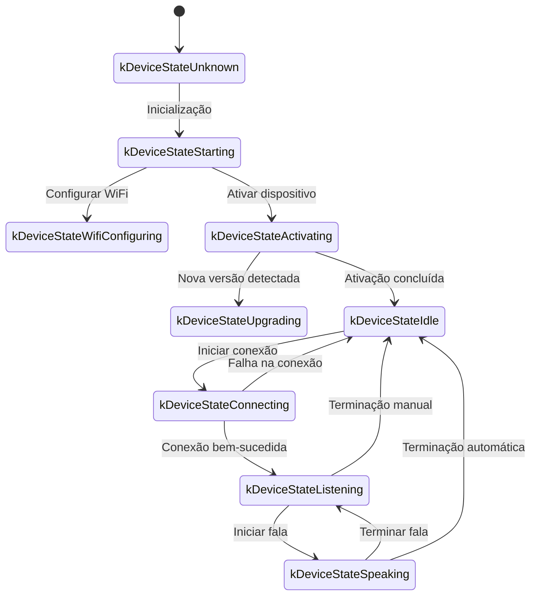
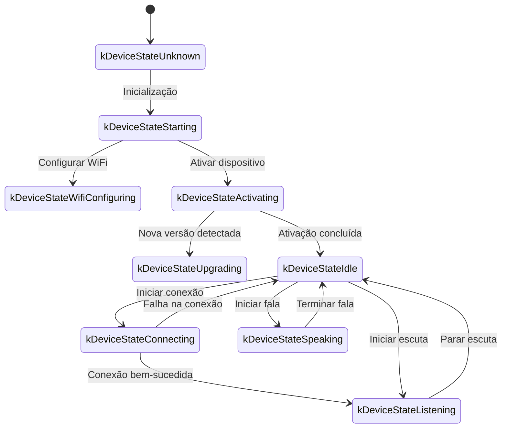

Segue uma documentação do protocolo de comunicação WebSocket organizada com base na implementação do código, descrevendo como o dispositivo e o servidor interagem através do WebSocket.

Este documento é baseado apenas na inferência do código fornecido. Na implantação real, pode ser necessário confirmar ou complementar com base na implementação do lado do servidor.

---

## 1. Visão Geral do Fluxo Total

1. **Inicialização do Dispositivo**  
   - Dispositivo ligado, inicialização da `Application`:  
     - Inicializa codec de áudio, tela, LED, etc  
     - Conecta à rede  
     - Cria e inicializa instância do protocolo WebSocket implementando interface `Protocol` (`WebsocketProtocol`)  
   - Entra no loop principal aguardando eventos (entrada de áudio, saída de áudio, tarefas agendadas, etc.).

2. **Estabelecimento de Conexão WebSocket**  
   - Quando o dispositivo precisa iniciar uma sessão de voz (por exemplo, despertar do usuário, acionamento manual de botão, etc.), chama `OpenAudioChannel()`:  
     - Obtém URL WebSocket da configuração
     - Define vários cabeçalhos de requisição (`Authorization`, `Protocol-Version`, `Device-Id`, `Client-Id`)  
     - Chama `Connect()` para estabelecer conexão WebSocket com o servidor  

3. **Dispositivo Envia Mensagem "hello"**  
   - Após conexão bem-sucedida, o dispositivo envia uma mensagem JSON, exemplo de estrutura:  
   ```json
   {
     "type": "hello",
     "version": 1,
     "features": {
       "mcp": true
     },
     "transport": "websocket",
     "audio_params": {
       "format": "opus",
       "sample_rate": 16000,
       "channels": 1,
       "frame_duration": 60
     }
   }
   ```
   - O campo `features` é opcional, o conteúdo é gerado automaticamente de acordo com a configuração de compilação do dispositivo. Por exemplo: `"mcp": true` indica suporte ao protocolo MCP.
   - O valor de `frame_duration` corresponde a `OPUS_FRAME_DURATION_MS` (por exemplo, 60ms).

4. **Servidor Responde "hello"**  
   - O dispositivo aguarda o servidor retornar uma mensagem JSON contendo `"type": "hello"` e verifica se `"transport": "websocket"` corresponde.  
   - O servidor pode opcionalmente enviar o campo `session_id`, que o dispositivo registrará automaticamente após receber.  
   - Exemplo:
   ```json
   {
     "type": "hello",
     "transport": "websocket",
     "session_id": "xxx",
     "audio_params": {
       "format": "opus",
       "sample_rate": 24000,
       "channels": 1,
       "frame_duration": 60
     }
   }
   ```
   - Se houver correspondência, considera-se que o servidor está pronto e marca a abertura do canal de áudio como bem-sucedida.  
   - Se não receber resposta correta dentro do tempo limite (padrão 10 segundos), considera a conexão falha e aciona callback de erro de rede.

5. **Interação de Mensagens Subsequentes**  
   - Entre dispositivo e servidor podem ser enviados dois tipos principais de dados:  
     1. **Dados de áudio binários** (codificação Opus)  
     2. **Mensagens JSON de texto** (para transmitir estado de chat, eventos TTS/STT, mensagens de protocolo MCP, etc)  

   - No código, o callback de recepção é dividido principalmente em:  
     - `OnData(...)`:  
       - Quando `binary` é `true`, considera-se quadro de áudio; dispositivo tratará como dados Opus para decodificação.  
       - Quando `binary` é `false`, considera-se texto JSON, precisa ser analisado no dispositivo com cJSON e processamento de lógica de negócios correspondente (como chat, TTS, mensagens de protocolo MCP, etc).  

   - Quando servidor ou rede desconecta, callback `OnDisconnected()` é acionado:  
     - Dispositivo chamará `on_audio_channel_closed_()` e finalmente retornará ao estado ocioso.

6. **Fechamento de Conexão WebSocket**  
   - Quando dispositivo precisa encerrar sessão de voz, chamará `CloseAudioChannel()` para desconectar ativamente e retornar ao estado ocioso.  
   - Ou se o servidor desconectar ativamente, também acionará o mesmo fluxo de callback.

---

## 2. Cabeçalhos de Requisição Comuns

Ao estabelecer conexão WebSocket, o exemplo de código define os seguintes cabeçalhos de requisição:

- `Authorization`: Usado para armazenar token de acesso, no formato `"Bearer <token>"`  
- `Protocol-Version`: Número da versão do protocolo, mantém consistência com o campo `version` no corpo da mensagem hello  
- `Device-Id`: Endereço MAC físico do adaptador de rede do dispositivo
- `Client-Id`: UUID gerado por software (será resetado ao apagar NVS ou regravar firmware completo)

Esses cabeçalhos serão enviados junto com o handshake WebSocket para o servidor, que pode realizar validação, autenticação, etc., conforme necessário.

---

## 3. Versão do Protocolo Binário

O dispositivo suporta várias versões de protocolo binário, especificadas através do campo `version` na configuração:

### 3.1 Versão 1 (Padrão)
Envia dados de áudio Opus diretamente, sem metadados adicionais. O protocolo WebSocket distingue entre texto e binário.

### 3.2 Versão 2
Usa estrutura `BinaryProtocol2`:
```c
struct BinaryProtocol2 {
    uint16_t version;        // Versão do protocolo
    uint16_t type;           // Tipo de mensagem (0: OPUS, 1: JSON)
    uint32_t reserved;       // Campo reservado
    uint32_t timestamp;      // Timestamp (milissegundos, usado para AEC no lado do servidor)
    uint32_t payload_size;   // Tamanho da carga útil (bytes)
    uint8_t payload[];       // Dados da carga útil
} __attribute__((packed));
```

### 3.3 Versão 3
Usa estrutura `BinaryProtocol3`:
```c
struct BinaryProtocol3 {
    uint8_t type;            // Tipo de mensagem
    uint8_t reserved;        // Campo reservado
    uint16_t payload_size;   // Tamanho da carga útil
    uint8_t payload[];       // Dados da carga útil
} __attribute__((packed));
```

---

## 4. Estrutura de Mensagens JSON

Quadros de texto WebSocket são transmitidos em formato JSON. A seguir estão os campos `"type"` comuns e sua lógica de negócios correspondente. Se a mensagem contiver campos não listados, podem ser opcionais ou detalhes de implementação específicos.

### 4.1 Dispositivo → Servidor

1. **Hello**  
   - Após conexão bem-sucedida, enviado pelo dispositivo para informar ao servidor os parâmetros básicos.  
   - Exemplo:
     ```json
     {
       "type": "hello",
       "version": 1,
       "features": {
         "mcp": true
       },
       "transport": "websocket",
       "audio_params": {
         "format": "opus",
         "sample_rate": 16000,
         "channels": 1,
         "frame_duration": 60
       }
     }
     ```

2. **Listen**  
   - Indica que o dispositivo está iniciando ou parando de escutar gravação.  
   - Campos comuns:  
     - `"session_id"`: Identificador da sessão  
     - `"type": "listen"`  
     - `"state"`: `"start"`, `"stop"`, `"detect"` (detecção de palavra de ativação acionada)  
     - `"mode"`: `"auto"`, `"manual"` ou `"realtime"`, indica o modo de reconhecimento.  
   - Exemplo: Iniciar escuta  
     ```json
     {
       "session_id": "xxx",
       "type": "listen",
       "state": "start",
       "mode": "manual"
     }
     ```

3. **Abort**  
   - Termina a fala atual (reprodução TTS) ou canal de voz.  
   - Exemplo:
     ```json
     {
       "session_id": "xxx",
       "type": "abort",
       "reason": "wake_word_detected"
     }
     ```
   - Valor de `reason` pode ser `"wake_word_detected"` ou outro.

4. **Wake Word Detected**  
   - Usado pelo dispositivo para informar ao servidor que detectou palavra de ativação.
   - Antes de enviar esta mensagem, pode enviar antecipadamente os dados de áudio Opus da palavra de ativação para o servidor realizar detecção de impressão vocal.  
   - Exemplo:
     ```json
     {
       "session_id": "xxx",
       "type": "listen",
       "state": "detect",
       "text": "você aí pequeno"
     }
     ```

5. **MCP**
   - Protocolo de nova geração recomendado para controle IoT. Toda descoberta de capacidades do dispositivo, invocação de ferramentas, etc., são realizadas através de mensagens type: "mcp", com payload interno sendo JSON-RPC 2.0 padrão (veja detalhes em [Documentação do Protocolo MCP](./mcp-protocol.md)).
   
   - **Exemplo do dispositivo enviando result para o servidor:**
     ```json
     {
       "session_id": "xxx",
       "type": "mcp",
       "payload": {
         "jsonrpc": "2.0",
         "id": 1,
         "result": {
           "content": [
             { "type": "text", "text": "true" }
           ],
           "isError": false
         }
       }
     }
     ```

---

### 4.2 Servidor → Dispositivo

1. **Hello**  
   - Mensagem de confirmação de handshake retornada pelo servidor.  
   - Deve conter `"type": "hello"` e `"transport": "websocket"`.  
   - Pode trazer `audio_params`, indicando os parâmetros de áudio esperados pelo servidor, ou configuração alinhada com o dispositivo.   
   - Servidor pode opcionalmente enviar campo `session_id`, que o dispositivo registrará automaticamente após receber.  
   - Após recepção bem-sucedida, o dispositivo definirá flag de evento indicando que o canal WebSocket está pronto.

2. **STT**  
   - `{"session_id": "xxx", "type": "stt", "text": "..."}`
   - Indica que o servidor reconheceu a voz do usuário. (Por exemplo, resultado de conversão de voz em texto)  
   - Dispositivo pode exibir este texto na tela e depois entrar no fluxo de resposta, etc.

3. **LLM**  
   - `{"session_id": "xxx", "type": "llm", "emotion": "happy", "text": "😀"}`
   - Servidor instrui dispositivo a ajustar animação de expressão / expressão de UI.  

4. **TTS**  
   - `{"session_id": "xxx", "type": "tts", "state": "start"}`: Servidor está pronto para enviar áudio TTS, dispositivo entra em estado de reprodução "speaking".  
   - `{"session_id": "xxx", "type": "tts", "state": "stop"}`: Indica fim deste TTS.  
   - `{"session_id": "xxx", "type": "tts", "state": "sentence_start", "text": "..."}`
     - Faz dispositivo exibir na interface o segmento de texto atual a ser reproduzido ou lido (por exemplo, para exibir ao usuário).  

5. **MCP**
   - Servidor envia instruções de controle IoT ou retorna resultado de invocação através de mensagem type: "mcp", estrutura de payload igual acima.
   
   - **Exemplo do servidor enviando tools/call para dispositivo:**
     ```json
     {
       "session_id": "xxx",
       "type": "mcp",
       "payload": {
         "jsonrpc": "2.0",
         "method": "tools/call",
         "params": {
           "name": "self.light.set_rgb",
           "arguments": { "r": 255, "g": 0, "b": 0 }
         },
         "id": 1
       }
     }
     ```

6. **System**
   - Comando de controle de sistema, comumente usado para atualização remota.
   - Exemplo:
     ```json
     {
       "session_id": "xxx",
       "type": "system",
       "command": "reboot"
     }
     ```
   - Comandos suportados:
     - `"reboot"`: Reiniciar dispositivo

7. **Custom** (Opcional)
   - Mensagem personalizada, suportada quando `CONFIG_RECEIVE_CUSTOM_MESSAGE` está habilitado.
   - Exemplo:
     ```json
     {
       "session_id": "xxx",
       "type": "custom",
       "payload": {
         "message": "Conteúdo personalizado"
       }
     }
     ```

8. **Dados de áudio: Quadro binário**  
   - Quando servidor envia quadro binário de áudio (codificação Opus), dispositivo decodifica e reproduz.  
   - Se dispositivo estiver em estado "listening" (gravação), quadros de áudio recebidos serão ignorados ou limpos para evitar conflito.

---

## 5. Codificação e Decodificação de Áudio

1. **Dispositivo Envia Dados de Gravação**  
   - Entrada de áudio passa por possível cancelamento de eco, redução de ruído ou ganho de volume, depois é empacotada através de codificação Opus como quadro binário enviado ao servidor.  
   - Dependendo da versão do protocolo, pode enviar dados Opus diretamente (versão 1) ou usar protocolo binário com metadados (versão 2/3).

2. **Dispositivo Reproduz Áudio Recebido**  
   - Ao receber quadro binário do servidor, também considera como dados Opus.  
   - Dispositivo fará decodificação e então passará para interface de saída de áudio para reprodução.  
   - Se taxa de amostragem de áudio do servidor for inconsistente com dispositivo, fará reamostragem após decodificação.

---

## 6. Transições de Estado Comuns

A seguir estão as transições de estado chave comuns do dispositivo, correspondentes às mensagens WebSocket:

1. **Idle** → **Connecting**  
   - Após acionamento do usuário ou despertar, dispositivo chama `OpenAudioChannel()` → estabelece conexão WebSocket → envia `"type":"hello"`.  

2. **Connecting** → **Listening**  
   - Após estabelecer conexão com sucesso, se continuar executando `SendStartListening(...)`, entra em estado de gravação. Neste momento dispositivo continuará codificando dados do microfone e enviando ao servidor.  

3. **Listening** → **Speaking**  
   - Recebe mensagem TTS Start do servidor (`{"type":"tts","state":"start"}`) → para gravação e reproduz áudio recebido.  

4. **Speaking** → **Idle**  
   - Servidor TTS Stop (`{"type":"tts","state":"stop"}`) → reprodução de áudio termina. Se não continuar entrando em escuta automática, retorna a Idle; se configurado para loop automático, entra novamente em Listening.  

5. **Listening** / **Speaking** → **Idle** (Encontra exceção ou interrupção ativa)  
   - Chama `SendAbortSpeaking(...)` ou `CloseAudioChannel()` → interrompe sessão → fecha WebSocket → estado retorna a Idle.  

### Diagrama de Transição de Estado em Modo Automático



### Diagrama de Transição de Estado em Modo Manual



---

## 7. Tratamento de Erros

1. **Falha na Conexão**  
   - Se `Connect(url)` retornar falha ou timeout aguardando mensagem "hello" do servidor, aciona callback `on_network_error_()`. Dispositivo mostrará "Não é possível conectar ao serviço" ou mensagem de erro similar.

2. **Desconexão do Servidor**  
   - Se WebSocket desconectar anormalmente, callback `OnDisconnected()`:  
     - Dispositivo chama callback `on_audio_channel_closed_()`  
     - Muda para Idle ou outra lógica de retentativa.

---

## 8. Outras Observações

1. **Autenticação**  
   - Dispositivo fornece autenticação através de `Authorization: Bearer <token>`, servidor precisa validar se é válido.  
   - Se token expirou ou é inválido, servidor pode recusar handshake ou desconectar posteriormente.

2. **Controle de Sessão**  
   - Algumas mensagens no código contêm `session_id`, usado para distinguir diálogos ou operações independentes. Servidor pode fazer processamento separado de diferentes sessões conforme necessário.

3. **Carga Útil de Áudio**  
   - Código usa formato Opus por padrão e define `sample_rate = 16000`, mono. Duração do quadro controlada por `OPUS_FRAME_DURATION_MS`, geralmente 60ms. Pode ajustar adequadamente conforme largura de banda ou desempenho. Para melhor efeito de reprodução de música, áudio downstream do servidor pode usar taxa de amostragem de 24000.

4. **Configuração de Versão do Protocolo**  
   - Configura versão do protocolo binário (1, 2 ou 3) através do campo `version` nas configurações
   - Versão 1: Envia dados Opus diretamente
   - Versão 2: Usa protocolo binário com timestamp, adequado para AEC no lado do servidor
   - Versão 3: Usa protocolo binário simplificado

5. **Controle IoT Recomenda Protocolo MCP**  
   - Descoberta de capacidades IoT entre dispositivo e servidor, sincronização de estado, instruções de controle, etc., recomenda-se implementar tudo através do protocolo MCP (type: "mcp"). A solução antiga type: "iot" foi descontinuada.
   - Protocolo MCP pode ser transmitido sobre vários protocolos subjacentes como WebSocket, MQTT, etc., com melhor escalabilidade e capacidade de padronização.
   - Para uso detalhado, consulte [Documentação do Protocolo MCP](./mcp-protocol.md) e [Uso de Controle IoT MCP](./mcp-usage.md).

6. **JSON com Erro ou Exceção**  
   - Quando JSON falta campos necessários, por exemplo `{"type": ...}`, dispositivo registrará log de erro (`ESP_LOGE(TAG, "Missing message type, data: %s", data);`), não executará nenhum negócio.

---

## 9. Exemplos de Mensagens

Abaixo um exemplo típico de mensagens bidirecionais (fluxo simplificado para ilustração):

1. **Dispositivo → Servidor** (Handshake)
   ```json
   {
     "type": "hello",
     "version": 1,
     "features": {
       "mcp": true
     },
     "transport": "websocket",
     "audio_params": {
       "format": "opus",
       "sample_rate": 16000,
       "channels": 1,
       "frame_duration": 60
     }
   }
   ```

2. **Servidor → Dispositivo** (Resposta de Handshake)
   ```json
   {
     "type": "hello",
     "transport": "websocket",
     "session_id": "xxx",
     "audio_params": {
       "format": "opus",
       "sample_rate": 16000
     }
   }
   ```

3. **Dispositivo → Servidor** (Iniciar escuta)
   ```json
   {
     "session_id": "xxx",
     "type": "listen",
     "state": "start",
     "mode": "auto"
   }
   ```
   Ao mesmo tempo, dispositivo começa a enviar quadros binários (dados Opus).

4. **Servidor → Dispositivo** (Resultado ASR)
   ```json
   {
     "session_id": "xxx",
     "type": "stt",
     "text": "O que o usuário disse"
   }
   ```

5. **Servidor → Dispositivo** (TTS Iniciar)
   ```json
   {
     "session_id": "xxx",
     "type": "tts",
     "state": "start"
   }
   ```
   Então servidor envia quadros binários de áudio para dispositivo reproduzir.

6. **Servidor → Dispositivo** (TTS Terminar)
   ```json
   {
     "session_id": "xxx",
     "type": "tts",
     "state": "stop"
   }
   ```
   Dispositivo para reprodução de áudio, se não houver mais instruções, retorna ao estado ocioso.

---

## 10. Conclusão

Este protocolo transmite quadros de áudio binários e texto JSON sobre camada WebSocket, completando funcionalidades incluindo upload de fluxo de áudio, reprodução de áudio TTS, reconhecimento de voz e gerenciamento de estado, envio de instruções MCP, etc. Suas características principais:

- **Fase de Handshake**: Envia `"type":"hello"`, aguarda retorno do servidor.  
- **Canal de Áudio**: Transmissão bidirecional de fluxo de voz usando quadros binários de codificação Opus, suporta várias versões de protocolo.  
- **Mensagens JSON**: Usa `"type"` como campo central identificando diferentes lógicas de negócio, incluindo TTS, STT, MCP, WakeWord, System, Custom, etc.  
- **Escalabilidade**: Pode adicionar campos em mensagens JSON conforme necessidade real, ou realizar autenticação adicional em headers.

Servidor e dispositivo precisam acordar antecipadamente o significado dos campos de cada tipo de mensagem, lógica de sequência e regras de tratamento de erros para garantir comunicação suave. As informações acima podem servir como documento base, facilitando integração, desenvolvimento ou expansão subsequente.
